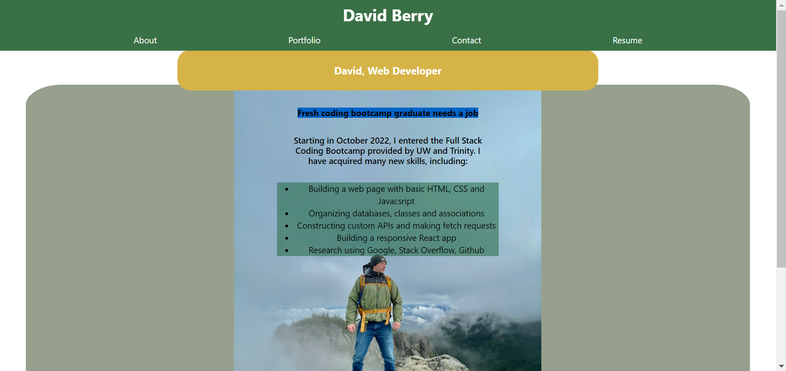

# forest-medallion

## Description
A Developer Portfolio built with React and deployed to Github Pages.

## Motivation
To show off my style and try to get a job in the tech world!

## Screenshots

## Live URL
[Check it out](https://dberry38.github.io/forest-medallion/)

## Future Development
This is only the beginning, check in for regular updates!

### *In the works:*
- Responsive styling

## Credits
The awesome folks at AskBCS and the bootcamp tutors who helped me get this thing functional.

## Contact
[Visit my Github](https://github.com/dberry38)

[Or send an email](mailto:davidberry38@gmail.com)